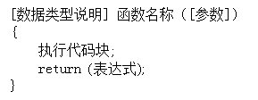

## 面向过程编程

编程是为了使用计算机解决问题，而受制于人类解决问题的一般思考方式，面向过程编程成为C语言编程时的常用编程范式, 即首先分析出解决问题所需要的步骤，然后用函数把这些步骤一步一步实现，使用的时候依次调用即可。

### 程序的结构

代码的执行结构只有三种，对应不同的代码执行顺序：

1. 顺序：按部就班的执行 默认模式
2. 判断：跳转执行 if else 与 switch语句
3. 循环：循环执行 while 和 for 语句

这三种结构是程序设计中最基本的三种设计思想。

小练习：
> 找出 1~1000 内的素数 打印出来。
> 找出 1~1000 内第50个素数 打印出来。

### 函数式编程（分而治之）

这节课我们的主题是**函数**,它就像是一个程序中的子程序，是面向过程的程序设计的基本单元。编程人员可以把代码划分到不同的函数中，在逻辑上，划分通常是根据每个函数执行一个特定的任务来进行的。

每个C程序都至少有一个函数，即主函数 main()，大体上一个C程序就可以看作是一系列函数的组合。

我们通过把复杂任务进行拆分，每个子任务对应一个函数，通过一层一层的函数调用，就可以把复杂任务分解成简单的任务，逐步完成。而且在后期还可以进行代码复用，减少重复代码，例如上面练习题中，判断数字是否为素数的操作即可封装为一个函数。

C语言提供了大量的库函数，比如stdio.h提供输出函数，stdlib.h提供的系统函数，但是还是满足不了我们开发中的一些逻辑，所以这个时候需要自己定义函数，其定义方式如下：



1. []包含的内容可以省略，数据类型说明省略，默认是int类型函数；参数省略表示该函数是无参函数，参数不省略表示该函数是有参函数；

2. 函数名称遵循标识符命名规范；

3. 自定义函数尽量放在main函数之前，如果要放在main函数后面的话，需要在main函数之前先声明自定义函数，声明格式为：[数据类型说明] 函数名称（[参数]）

4. C语言使用函数名对函数进行唯一标识，，只要是同名函数，就算函数的参数列表不同。也全被视作相同函数，不能重复定义。

### 函数调用栈——递归函数

在计算机中，函数调用是通过栈（stack）这种高级数据结构实现的（类比从盒子里取书）每当进入一个函数调用，栈顶就会加一层栈帧，每当函数返回，栈顶就会减一层栈帧。

递归是一个函数在它的函数体内调用它自身。执行递归函数将反复调用其自身，每调用一次就进入新的一层函数调用栈,由于栈的大小不是无限的，所以，递归调用的次数过多，会导致栈溢出。

递归函数的结构:

1. 递归停止条件
2. 递归函数调用

使用递归函数的优点是逻辑简单清晰，缺点是过深的调用会导致栈溢出

小练习

使用递归的思想，实现斐波那契数列，并解释函数栈的调用过程

```c

int fib(int n){
    // 递归停止条件
    if (n <= 0) return 0; 
    if (n == 1 || n == 2) return 1;
    // 递归函数
    else return fib(n-1) + fib(n-2);
}
```

### 课后练习

1. 使用递归的方式，解决汉诺塔问题。
