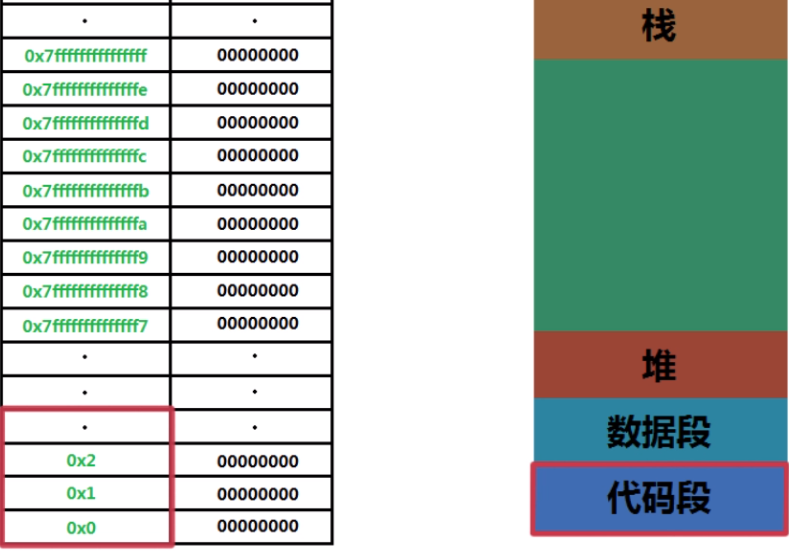

## 指针与内存管理

现代高级编程语言中，C语言在运算速度和执行效率方面可以说是难逢敌手，甚至很多流行的编程语言，例如 java 和 python，它们很多底层的实现都使用的C语言。

一门语言的抽象程度越高，效率就会越低，C语言程序的高效率得益于其贴近底层的设计：用户（程序员）可以直接操作计算机的内存，没有中间商赚差价。

C语言中实现对内存操作的就是传说中的**指针**。

### 内存管理

计算机中所有程序的运行都是在内存中进行的，大体上，程序的执行过程可以简单描述为：CPU从内存读取指令，再根据读取到的指令，读取内存中的数据并执行计算，处理结果最后再写回到内存。

计算机的内存由内存地址和内存空间组成，每个内存地址，对应一个内存空间。在计算机中，存储器的容量是以字节为基本单位的。也就是说一个内存地址唯一标识一个字节（8bit）的存储空间。

直观的来理解，可以把内存看作一个大柜子，上面有很多个带着编号（内存地址）的小抽屉，每个抽屉（内存空间）都能容纳八个二级制位的数据。

这个盒子的类比大家有没有觉得很熟悉。之前在介绍C语言的变量的时候我们也是这么类比的。

每种编程语言都有自己操作内存的方式，而C语言的变量由于直接存储值，其本质就是内存，每个变量对应于一个特定大小的内存单元。变量存储值和变量的地址（对变量使用取地址符号&），就对应了内存空间的存值和内存地址。

#### C程序的内存分配

用户在运行一个程序时，程序不是整个加载到内存中，而是分块载入到不同的内存区域，通常，程序所访问到的地址都是逻辑地址，并不是真实的物理地址，这个逻辑地址是操作系统提供的，CPU在执行指令时需要先将指令的逻辑地址变换为物理地址才能对相应的存储单元进行数据的读取或者写入（注意逻辑地址和物理地址是一一对应的）。

这里介绍一下C程序执行时，Linux操作系统为程序分配的内存情况。左边代表的是自下而上递增的内存空间，右边是对应的内存分配。



##### 栈

由编译器自动分配释放，每当一个函数被调用，函数的返回地址和调用信息等会被存储到栈区（函数进栈），然后这个被调用的函数会为它的局部变量和函数形参在栈区上分配空间。

栈是由高地址向低地址扩展(栈底在上)，有先进后出的特点，即依次定义两个局部变量，首先定义的变量地址是高地址，往后定义的变量地址是低地址。

##### 堆

存放程序运行中动态分配的存储空间。它的大小，并不固定，可动态扩张或缩放。当进程调用malloc/free等函数分配内存时，新分配的内存就被动态添加到堆上（堆被扩张）/释放的内存从堆中被提出（堆被缩减）。堆是低地址向高地址扩展的，是一块不连续的内存区域（和数据结构中的堆是两回事）

##### 代码段

用来存放CPU要执行的机器指令（即源代码编译后的机器码），也包含一些只读的常数变量，例如字符串常量等。

##### 数据段 

全局变量和静态变量（static修饰的）存储在这里。

##### 变量作用域的本质

变量的本质就是内存。定义在函数内的变量，只会在函数栈中开辟内空间，一旦执行完毕函数出栈，拥有的内存空间就会被清空，所以局部变量的作用域只在函数体内。同理，可以分析，保存在数据段的全局变量和static变量，只要程序还在执行过程中，就永远不会被清空。

> 计算机只能保存二进制的数字，我们看到的各种各样的数据（图片，文字，音频等），其实都是按照一定的规则，在二进制和数据本身之间进行编码解码。例如，在计算机系统中，整数数值一律用补码来表示和存储。

### 神奇的指针变量

介绍完内存管理机制，现在终于轮到我们真正的主角**指针**上场了，C语言正是通过将指针暴露给用户(程序员)，让用户可以自由的操作底层的内存。

指针的本质是存放内存地址的特殊**变量**，其值为内存位置的直接地址。就像其他变量或常量一样，在使用指针存储其他变量地址之前，必须对其进行定义。指针变量声明的一般形式为：

```c
type *var-name;
```

在这里，type 是指针的类型，它必须是一个有效的 C 数据类型，星号是用来指定一个变量是指针，var-name 是指针变量的变量名,以下是有效的指针定义：

```c
int * ip;    // 一个整型的指针变量 ip
double * dp;    // 一个 double 型的指针 dp 
float * fp;    // 一个浮点型的指针 fp
char * ch;     // 一个字符型的指针 ch
```

#### 指针的操作

使用指针时的常用操作：把变量地址赋值给指针。使用一元运算符 * 来返回位于操作数所指定地址的变量的值，指针加减运算。下面的实例涉及到了这些操作。

```c
int  var = 20;   /* 实际变量的声明 */
int  *ip =NULL;        /* 指针变量的声明 可以初始化为NULL */

ip = &var;  /* 在指针变量中存储 var 的地址，注意类型一致 */

/* 变量的内存地址 */
printf("Address of var variable: %p\n", &var  );

/* 在指针变量中存储的变量的内存地址 */
printf("Address stored in ip variable: %p\n", ip );

/* 使用指针访问变量的值 */
printf("Value of *ip variable: %d\n", *ip );

/*对指针进行递增，递减运算，即按照指针的数据类型，左（-）右（+）移动对应的字节数，返回此时指针指向的新位置的内存地址 */
printf("指针指向的上个单元的存储地址: %p\n", ip - 1 );
```

C语言中参数传递的方式分为值传递和地址传递, 地址传递允许我们可以使用指针直接对变量的内存进行操作。

我们这节课会使用 gdb 对C语言中实现变量交换的代码进行分析，看看C语言函数参数传递的过程。

```c
void swap1(int a, int b)
{
    t = a;
    a = b;
    b = t;
}


void swap2(int * a, int * b)
{
    t = *a;
    *a = *b;
    *b = t;
}

```

> 思考一下，为什么 ```scanf("%d", &f)```后面传入的参数是变量地址。 

#### 特殊的指针

1. **函数指针**，它是指向函数的指针。通常我们说的指针变量是指向一个整型、字符型或数组等变量，而函数指针是指向函数。函数指针可以像一般函数一样，用于调用函数、传递参数。```typedef int (*fun_ptr)(int,int)``` 指向一个返回值为int 参数为两个int的函数。通常是用于实现回调函数，即将函数指针作为其他函数的参数。
    ```c
    int max(int x, int y)
    {
        return x > y ? x : y;
    }

    int main(void)
    {
        /* p 是函数指针 */
        int (* p)(int, int) = & max; // &可以省略
        int a, b, c, d;

        printf("请输入三个数字:");
        scanf("%d %d %d", & a, & b, & c);

        /* 与直接调用函数等价，d = max(max(a, b), c) */
        d = p(p(a, b), c); 

        printf("最大的数字是: %d\n", d);

        return 0;
    }
    ```

### 课后作业

完成课本书籍或[网上题库](http://www.runoob.com/cprogramming/c-examples.html)关于指针的练习题，对于做错和不能理解的题目，学会使用gdb调试工具进行调试和实验，自主学习。