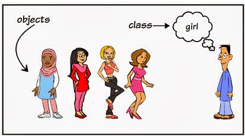
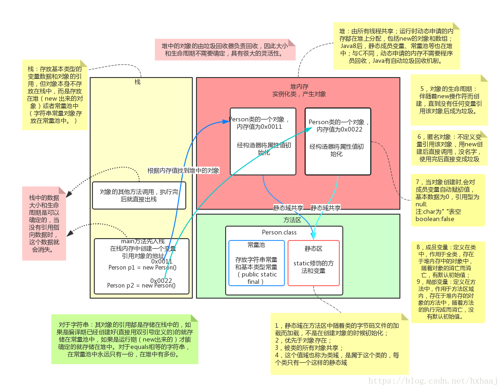

## 一切都是对象

C语言是典型的面向过程的编程语言，一个C程序可以看作是一系列函数的集合(自己列了个完成任务的步骤清单)。而一个Java程序则可以认为是一系列对象的集合，这些对象通过发送信息来协同工作(找了个对象，把要做的事情告诉他)。

每种编程语言都有自己操作内存的方式，C语言更贴近底层，通过指针用户可以直接对内存进行操作，而java里把一切都看作对象，变量的标识符实际上是对象的一个"引用"。可以想象成使用遥控器（引用）来操纵电视机（对象），如果在房间里想要对电视机进行操作，只需要通过遥控器，而不需要跑到电视机旁边手动操作。

Java是完全的面向对象编程语言，对象是java程序的基本组成部分，在Java中（几乎）一切都是对象。

### Java中的对象和类

现在让我们深入了解什么是对象。看看周围真实的世界，会发现身边有很多对象，车，狗，人等等。所有这些对象都有自己的状态和行为。

拿一条狗来举例，它的状态有：名字、品种、颜色，行为有：叫、摇尾巴和跑。

对比现实中的对象和软件对象，它们之间十分相似。

软件对象也有状态和行为。软件对象的状态就是属性，行为通过方法来体现。

在软件开发中，方法可以操作对象内部的状态，对象的相互调用也是通过方法来完成。

* 成员变量：每个对象都有独特的实例变量，对象的状态由这些实例变量的值决定。
* 方法：方法就是行为，一个类可以有很多方法。逻辑运算、属性修改以及所有动作都是在方法中完成的。

如果一切都是对象，那么什么决定了某一类对象的外观与行为呢。换句话说，什么决定了对象的类型？Java中一般使用class关键字，告诉程序，我想要的对象看起来是什么样子的。类就相当于是一个模板，它描述一类对象的行为和状态。从类中创建对象使用new 关键字。

下图中女孩为类，而具体的每个人为该类的对象：



``` java
class Girl {
    // 成员变量
    String name;
    int age;
    // 方法
    void say(){
        /* method body */
    }
}

Girl Lisa = new Girl();
Lisa.name
Lisa.say()
```

### 内存表示

1. 栈 存放方法的调用信息以及方法中定义的局部变量
2. 堆 用于存放所有new出来的Java对象和对象中的成员变量
3. 方法区 类装载后保存在这个位置，存放的是类中定义的方法，基本类型常量和字符串常量、static修饰的全局变量和函数。



#### 特例1：基本类型

java中的变量通常保存的都是对象的引用，但对于基本类型数据，java采取和C语言相同的存储方式，不使用 new 来创建对象,而是直接在变量里存储值。所以在java中 == 运算符，如果是基本数据类型比较的是值，对引用类型比较的是地址。

基本数据类型作为对象的成员变量时，即使没有进行变量初始化，也会有一个默认值。如果它是定义在方法中的普通局部变量，则不会进行默认初始化。

#### 特例2：字符串字面量

字符串对象非常特殊，一旦创建就不能被改变的。我们对字符串做操作时，实际上并没有改变原对象，而是直接创建了一个包含原始对象的新的对象。

``` java
String s = "123"; // 使用字面量创建String对象
String s2 = new String("123") // 使用new关键字创建String对象

String s3 = s + "456"; // 创建了新的对象
```

当一个.class文件被加载时（注意加载发生在初始化之前），JVM在.class文件中寻找字符串字面量。当找到一个时，JVM会检查是否有相等的字符串在常量池中存放了堆中引用。如果找不到，就会在堆中创建一个对象，然后将它的引用存放在池中的一个常量表中。

所以使用字符串字面量创建对象比较特殊，一旦一个字符串对象的引用在常量池中被创建（之前已经使用过），这个字符串在程序中的所有字面量引用都会被常量池中已经存在的那个引用代替。


**注意**

java 中 char 使用Unicode编码，占据两个字节。 

#### 第一个java程序

创建 Hello.java 文件。注意：如果想创建一个独立运行的程序，入口文件中必须含有某个类和文件同名，且这个类中必须有个静态的main方法。

``` java
public class Hello {
    public static void main(String[] args) {
        System.out.println("hello!");
    }
}

/* 编译命令

javac Hello.java 编译成字节码
java hello jvm运行字节码

*/
```

课堂练习：

> 使用命令行编译的形式，运行你的 Hello.java 程序。

## 面向对象编程

面向对象编程——Object Oriented Programming，简称OOP，是一种程序设计思想。OOP把对象作为程序的基本单元，一个对象中包含了数据和操作数据的函数。

面向过程的程序设计把计算机程序视为一系列的命令集合，即一组函数的顺序执行。为了简化程序设计，面向过程把函数继续切分为子函数，即把大块函数通过切割成小块函数来降低系统的复杂度。

而面向对象的程序设计把计算机程序视为一组对象的集合，而每个对象都可以接收其他对象发过来的消息，并处理这些消息，计算机程序的执行就是一系列消息在各个对象之间传递。

假设我们要处理学生的成绩表,如果采用面向对象的程序设计思想，我们首选思考的不是程序的执行流程，而是Student这种数据类型应该被视为一个对象，这个对象拥有name和score这两个属性（Property）。如果要打印一个学生的成绩，首先必须创建出这个学生对应的对象，然后，给对象发一个print_score消息，让对象自己把自己的数据打印出来。

所以，面向对象的设计思想是抽象出Class，根据Class创建对象，通过对象来构建程序。

### 数据封装与访问权限

java使用构造器确保对象的初始化,所有的java类都拥有自己的构造器，如果你写的类中没有构造器，则编译器会自动帮你创建一个默认的构造器。如果已经自己定义了一个构造器，编译器就不会再自动创建默认构造器。同一个类中可以定义多个构造函数，每个函数拥有不同的参数列表，被称为构造函数的重载。类似构造函数的重载，类中也可以拥有多个同名但参数列表不同的方法，即方法的重载。

```java
public class Student {

    //成员变量
    public String name;
    public int score;

    // 带参数的构造方法
    public Student(String name, int score) {
        this.name = name;
        this.score = score;
    }
    // 无参数的默认构造方法
    public Student(){}

    //方法
    public void print_score() {
        System.out.printf("%s的分数是%s\n", this.name, this.score);
    }

}

// 测试带参数的构造方法
Student Lisa = new Student("Lisa", 97);
Lisa.print_score() 

// 测试不带参数的构造方法
Student Lisa = new Student();
Lisa.print_score() 
```

面向对象编程的一个重要特点就是数据封装。在上面的Student类中，每个Student的对象例如Lisa，拥有各自的name和score这些数据。我们可以通过方法来访问或者修改这些数据，比如打印一个学生的成绩。我们从外部看Student类，只需要知道创建实例需要给出name和score，而如何打印，是在Student类的内部定义的，这些数据和逻辑被“封装”起来了，使用者不用知道内部实现的细节，调用起来很容易。

但是，从前面Student类的定义来看，外部代码还是可以自由地修改一个实例的name、score属性。这是很不安全的，如果想让内部属性不被外部访问到，可以把属性的名称前加上private，代表只有类的内部可以访问这些数据。除了属性，对于方法也是类似，只暴露给用户他需要的接口。

访问权限


Java声明变量或方法的时候没有写上修饰符为default。

课堂练习：

> 使用get，set方法改写Student类，隐藏内部属性的同时，保证设置属性时进行必要的参数检查。

### 继承与多态

在OOP程序设计中，当我们定义一个class的时候，可以从某个现有的class继承，新的class称为子类（Subclass），而被继承的class称为基类、父类或超类（Base class、Super class）。

比如，我们已经编写了一个名为Animal的class，有一个say()方法可以直接打印：

``` java
class Animal{

    public void say():
        System.out.println('Animal is saying...');

}
```

当我们需要编写Dog和Cat类时，就可以直接从Animal类继承：

``` java

class Dog extends Animal {}

class Cat extends Animal {}
```

对于Dog来说，Animal就是它的父类，对于Animal来说，Dog就是它的子类。Cat和Dog类似。

继承有什么好处？最大的好处是子类获得了父类的全部功能。由于Animial实现了say()方法，因此，Dog和Cat作为它的子类，什么事也没干，就自动拥有了run()方法。

可此时无论是Dog还是Cat，它们say()的时候，显示的都是Animal is saying，符合逻辑的做法应该是分别显示 “Dog says 汪汪汪” 和 “Cat says 喵喵喵”。子类也可以重写从父类继承的方法（注意和重载区分）。

课堂练习：

> 1. 修改代码使得猫和狗拥有不同的说话行为，在测试类中写一个方法，传入不同的子类可以实现不同的行为。

**总结：**

继承可以把父类的所有功能都直接拿过来，这样就不必重零做起，子类只需要新增自己特有的方法，也可以把父类不适合的方法覆盖重写，通过继承实现多态

**注意：**

多态：即一个引用变量倒底会指向哪个类的实例对象，该引用变量发出的方法调用到底是哪个类中实现的方法，必须在由程序运行期间才能决定

#### 多态与接口

java中的继承只能是单继承，即只能拥有一个父类，但使用java的接口可以实现多重继承的效果，java提倡面向接口编程。

接口并不是类，编写接口的方式和类很相似，但是它们属于不同的概念。类描述对象的属性和方法。接口则包含类要实现的方法，

注意：接口中只包含抽象方法，不能包含成员变量（除了 static 和 final 变量）

下面是使用java8新特性，函数式接口实现回调函数的例子，注意函数式接口中有且仅有一个需要重写的方法。

``` java

@FunctionalInterface
interface GreetingByWeather {

    void geeting(Person person);

}

class Person {

    public String name;

    public Person (String name) {
        this.name = name;
    }

    public void greeting (GreetingByWeather greetingByWeather) {
        greetingByWeather.greeting(this);
    }

    public String say() {
        return "说：";
    }

}

public class Test {
    public static void main(String[] args) {
        Person ming = new Person("小明");
        ming.greeting(person -> {
            System.out.println(person.name + "没有出门");
        });
    }

}
```
课堂练习：

> 1. 使用接口的方式，实现上一节的代码，使得猫和狗拥有不同的说话行为。


